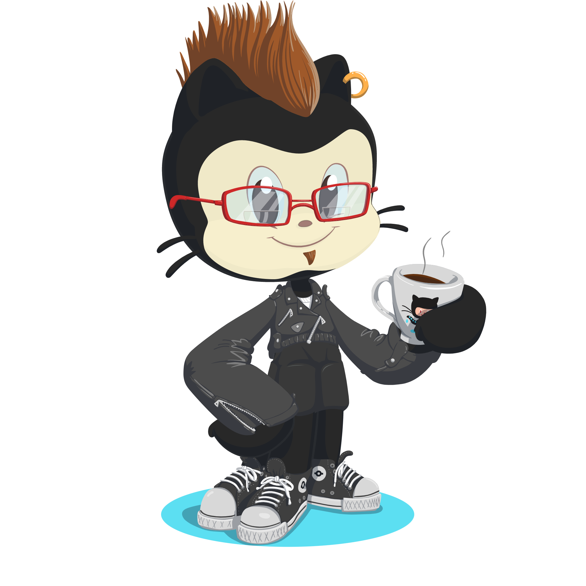

### Hi there 👋

 
Front-end Developer - Seeking knowledge and opportunities

* 🌍  I'm based in HCM city, Viet Nam
* ✉️  You can contact me at [thuy.tranthanh.bd@gmail.com](mailto:thuy.tranthanh.bd@gmail.com)
* 🚀  I'm currently working on [Personal Projects - Open to Work](https://expressmagazine.net/)
* 🧠  I'm learning Node.js, Express and Prisma
* 🤝  I'm open to collaborating on interesting projects
* ⚡  God gave you rock 'n' roll
* 🔭 I’m currently working on Patroids Creative Works
* 🌱 I’m currently learning Blockchain
* 👯 I’m looking to collaborate on Python, Nextjs
* 🤔 I’m looking for help with Flutter
* 💬 Ask me about Telegram 0944225212
* 📫 How to reach me [Personal Food Blog](https://denhatnuong.vn/)
* 😄 Pronouns: He/Him

  
  
  
  

#

<h2 align="left"><b>Skills</b></h2>

  
  
  
    
  
  
  
  
  
  
  
  
  
  
  
  
  
  
  
  

<h2 align="left"><b>GitHub Stats</b></h2>

